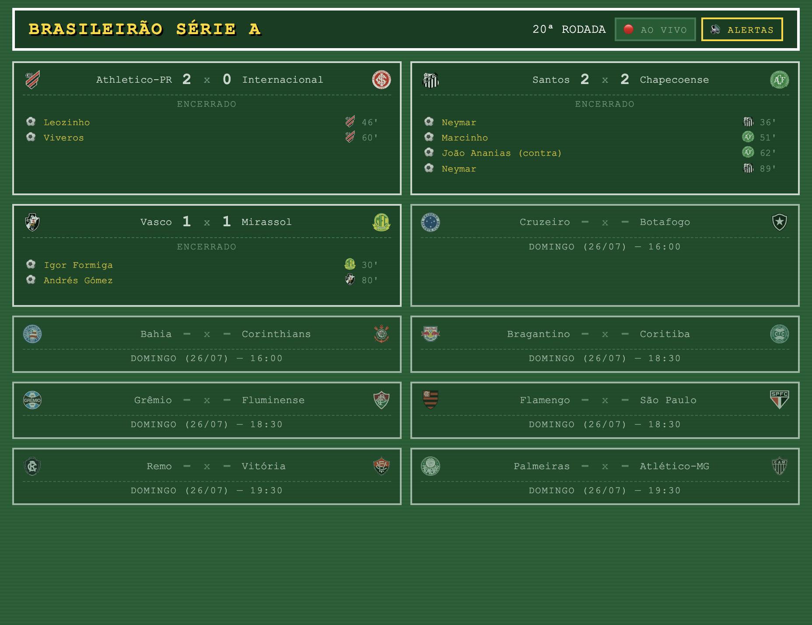

# Scoreboard Brasileirão Série A



Placar ao vivo dos jogos do Brasileirão Série A, com visual retrô inspirado na tela de resultados do Elifoot 98. Pensado para ser usado como página pública ou como overlay/Browser Source no OBS.

## Funcionalidades

- Placar e eventos (gols e cartões vermelhos, com jogador e minuto) de todas as partidas da rodada atual
- Escudos dos times, baixados uma vez e servidos localmente
- Atualização automática a cada 30 segundos
- Filtro para mostrar apenas partidas em andamento
- Alerta sonoro configurável ao sair um gol ou cartão vermelho (preferência salva em cookie)

## Como rodar localmente

```bash
python3 -m venv venv
source venv/bin/activate
pip install -r requirements.txt
uvicorn main:app --reload
```

Depois acesse http://127.0.0.1:8000

## Estrutura

```
scoreboard/
├── main.py             # FastAPI: inicia o scraper em background + serve API e estáticos
├── scraper.py          # busca e normaliza os dados do ge.globo.com
├── state.py            # estado compartilhado em memória (snapshot da rodada atual)
├── static/             # frontend (HTML/CSS/JS puro)
└── uploads/             # arquivos servidos publicamente (áudio do alerta, escudos)
```

Os escudos em `uploads/escudos/` são baixados automaticamente pelo scraper na primeira vez que cada time aparece numa rodada, por isso não fazem parte do repositório.

## Fonte de dados

Os dados são obtidos do [ge.globo.com](https://ge.globo.com/futebol/brasileirao-serie-a/), sem autenticação ou chave de API.

## Deploy

Pensado para hospedagem gratuita/hobby em serviços como Railway ou Render — processo único, sem banco de dados, leitura pública sem autenticação.
